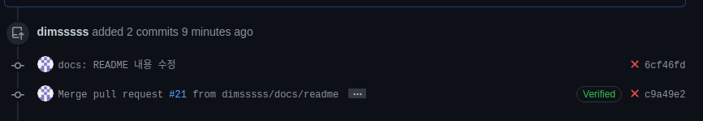
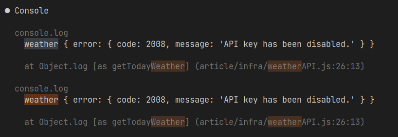

<p align="center">
    <h1 align="center">
        Writer API
    </h1>
    <p align="center">게시글을 작성하고 조회하는 API 입니다. 게시글 작성시 현재 날씨 정보를 자동으로 저장하고 설정한 password로 삭제, 수정이 가능합니다. infinite 스크롤을 염두에 둔 API입니다<a href="https://github.com/dimsssss/writer"></a>.</p>
</p>

<p align="center">
    <a href="">
        
    </a>
    <a href="">
        
    </a>
    <a href="https://expressjs.com/">
        
    </a>
    <a href="https://jestjs.io/">
        
    </a>
    <a href="https://sequelize.org/">
        
    </a>
    <a href="https://dl.circleci.com/status-badge/redirect/gh/dimsssss/writer/tree/main">
        
    </a>
</p>

## 무한 스크롤 조회

1. 게시글의 개수가 많을 때, 사용자가 앱이나 웹에서 스크롤을 내릴 때마다 오래된 글들이
   계속 로드 되는 형태로 API 를 수정해주세요.
2. 게시글이 중복으로 나타나면 안됩니다.
3. 추가 로드는 20 개 단위로 해주세요

무한 스크롤을 구현하기 위해서 **No offset 페이징으로 구현을 하였다**. 생각해본 방법은 두 가지가 있는데 각각의 장단점이 있다.

### Limit Offset을 이용한 데이터 조회

현재의 게시글에서 20개를 가져오려면 가장 먼저 생각나는 것은 select \* from offset limit을 이용하는 방법이다.

첫번째 조회를 할 때 페이징을 구현하여 전체 페이지 크기, 현재 페이지를, 한 페이지당 게시글 수(20개)를 모두 구해서 클라이언트에게 넘겨준다. 클라이언트는 스크롤을 내릴 때마다 필요한 페이지 번호를 넘겨주면 서버는 페이지 수에 해당하는 데이터를 넘겨준다.

offset은 현재 페이지 \* 페이지당 게시글 수이고 차례대로 20개를 가져온다(limit 20)

이 방법은 사용하지 않는 데이터도 다 읽는 단점이 있다. 예를 들어 아주 뒤에 있는 데이터를 가져올 때, 백만번부터 백만 10번까지의 데이터를 조회한다면 100만번까지 필요하지 않는 데이터를 하나씩 전부 읽고 뒤에 10개 데이터를 가져온다.요구하는 데이터가 뒤에 있을수록 느려지는 방법이다.

### No offset을 이용한 조회

이 방법은 offset에 해당하는 값을 PK로 잡아서 불필요한 읽기를 없애는 방법이다. Pk는 자동으로 인덱스가 걸려있기 때문에 시작점을 빠르게 찾을 수 있다. 단점으로는 numbering 페이지에서는 사용할 수 없다. 예를 들어
현재 보고 있는 데이터의 위치가 7 페이지라면 바로 1 페이지에 해당하는 데이터를 볼 수 없다.

### 실행 계획

인덱스가 동작하고 있는지 확인하기 위해 실행계획으로 조회 쿼리를 사용해보았다.

Backward index scan

처음보는 메시지여서 찾아보았는데 인덱스 키 값에 상관없이 오른쪽 leaf 노드에서 왼쪽으로 동작한다는 메시지였다. 요구 조건에서 최신순으로 데이터를 원했기 때문에 그에 맞게 정렬하면 당연히 역순으로 움직이는데 성능상의 이슈가 있었다

```
-> Limit: 20 row(s)  (cost=0.46 rows=1) (actual time=0.040..0.040 rows=0 loops=1)
    -> Filter: ((articles.deletedAt is null) and (articles.sequenceId < 4))  (cost=0.46 rows=1) (actual time=0.033..0.033 rows=0 loops=1)
        -> Index range scan on articles using PRIMARY  (cost=0.46 rows=1) (actual time=0.024..0.024 rows=0 loops=1)

-> Limit: 20 row(s)  (cost=0.71 rows=1) (actual time=0.052..0.052 rows=0 loops=1)
    -> Filter: (articles.deletedAt is null)  (cost=0.71 rows=1) (actual time=0.044..0.044 rows=0 loops=1)
        -> Index range scan on articles using articles_sequenceId_IDX, with index condition: (articles.sequenceId < 4)  (cost=0.71 rows=1) (actual time=0.037..0.037 rows=0 loops=1)
```

요약해보면 왼쪽으로 보나 오른쪽으로보나 똑같지만 mysql 내부적으로 잠금이 왼쪽에서 오른쪽으로 유리하게 되어 있다. 오름차순으로 조회를 하면 차례 대로 읽어가면서 잠그면 되지만 역순일 경우에는 아래와 같은 작업을 한다

1. 커서의 상태를 저장하고 내부 미니 트랜잭션을 커밋해서 미니 트랜잭션 버퍼를 글로벌 리두 로그 버퍼로 복사
2. 미니 트랜잭션을 재시작
3. 커서의 상태를 다시 복구 (이 과정에서 현재 블록이 이동되는 것을 막기 위해서 pinning을 하고 필요에 따라서 현재 블록과 이전 블록(Backward block)의 잠금을 획득)

글 내용에 따라 \***\*Descending index\*\***를 지정해서 역순으로 왼쪽부터 읽기 가능하게 바꿔보기로 했다

그러나 결과는 기존이 더 빠르다 아무래도 pk로 설정되어 있어서 결과가 더 빠른것으로 예상된다

[MySQL Ascending index vs Descending index](https://tech.kakao.com/2018/06/19/mysql-ascending-index-vs-descending-index/)

## 외부 환경과 종속 된 테스트 코드

테스트 코드에 Mock을 사용하면 좋은 점을 최근에 경험을 하였다. 기존에 있던 통합테스트를 Mock을 이용한 코드로 대체를 하였다.

### 변경 없는 코드가 테스트 실패

README를 수정하고 commit을 만들어서 저장소에 push를 하는데 테스트가 실패하였다



내심 당황했다. 마지막으로 테스트가 성공하는 것을 확인하고 수정된 내역이 없던 상황이었기 때문이다. 바로 개인 로컬에서 테스트를 돌려보았는데 동일하게 테스트가 실패를 하였다.



API Key를 갱신하라고 메일을 받았었는데 잊고 있었다. 문득 이 테스트를 Mock을 이용했더라면 더 좋았을 것 같다는 생각이 들었다. 테스트는 특별한 이유가 없다면 독립적이어야한다. 각각의 테스트는 서로 영향을 주지 않고 단일 단위로 실행이 가능해야 변경을 해도 말끔하게 돌아간다.

이 테스트는 코드에 변경이 없어도 외부 요인에 의해 실패를 하게 되었다. 변경 없는 코드가 실패를 하다가 성공을 하다가를 반복한다면 일관성이 없어지고 신뢰하기 힘들어진다. 외부 API key 갱신도 3주에 한번 정도 발생하는데 매번 수동으로 넣어주는 것도 귀찮다.

### 해결 방안

두 가지를 해결방안을 떠올렸는데 첫번째가 Mock을 이용하여 테스트 코드를 수정하는 것이다. 이 방법은 외부 API를 사용하지 않아서 독립적이고 네트워크를 사용하지 않아서 빠르다. 단점으로는 실제로 동작하는지는 보장을 하지 못한다.

다음으로는 배치 프로그램을 만들어서 API key를 갱신하는 방법이다. 이 방법은 생각하자마자 머리 속에서 지워버렸다. 먼저 배치 프로그램을 만드는 비용보다 테스트 코드를 수정하는 비용이 훨씬 저렴하다. 가장 큰 이유는 내가 사용하는 CI 플랫폼에서 보안상의 이유로 env 값 갱신을 거부할 수 있다

## 🧪 테스트

```shell
npm run test
```

## 🧾 실행

```shell
npm run dev
```

## 🌐 API Document

https://app.swaggerhub.com/apis-docs/dimsssss/post-api/1.0.0
